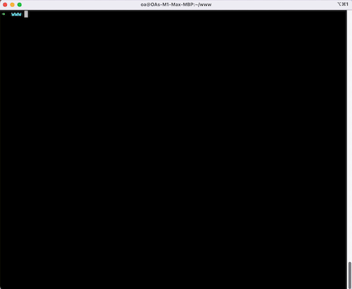

# 歡迎來到 OAGO 終端機工具

⌘ 使用 Golang 開發的 .bin 小工具

🎬 影片教學請看 ➜ [這裡](https://www.youtube.com/watch?v=WwJX4dupIKg)

> OAWU's Cli tool by golang

## 😅 注意！
注意！注意！ 請在 MacOS 環境使用，Windows 目前不支援。

## 說明
* 這是 OA 的個人工具，採用 Go 語言製作的 .bin 工具。
* 可以直些執行，若不符合規則，則會有提示。

## 功能
1. thumbnail - 可指定檔案，依據指定寬、高或者固定尺寸縮圖，可以輸出不同尺寸，如 iOS 系統常用的 @1x、@2x、@3x.. 等。
2. ios-app-icon - 可指定檔案，輸出符合 iOS APP 圖示的各種版本大小。

## 編譯
1. 打開終端機，進入專案目錄。
2. 於專案目錄內輸入指令 `go run main.go` 即可不用編譯就可以使用。
3. 想要重新編譯 `.bin` 檔案的話，可以於專案目錄內執行指令 `go build -o <.bin 名稱>`，例如要輸出 **oago** 的 `.bin`，就執行 `go build -o oago`
